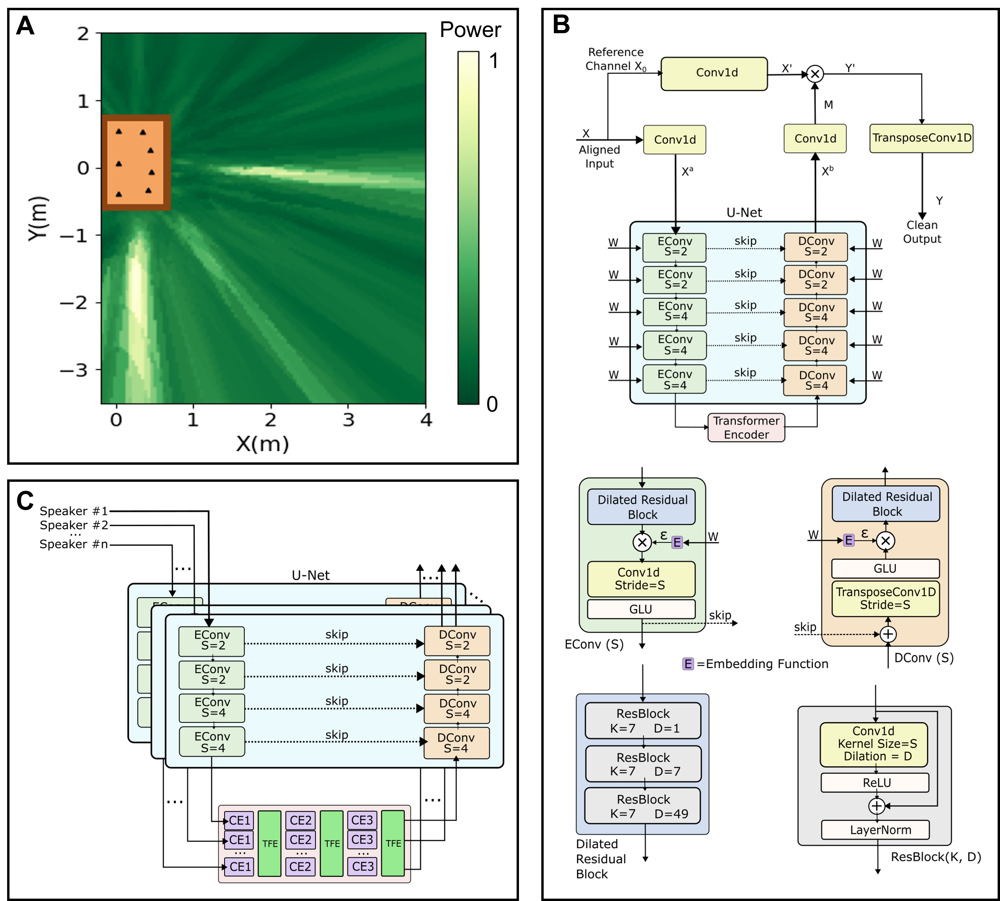

# Multi-speaker Localization and Source Separation using Distributed Microphone Arrays
The code for simultaneous Localization and Separation for 3D space. The algorithm can be generalized to different shapes and sizes of the microphones array. 

## Algorithm Description
### Algorithm Objective:
(1) output the 2D positions of all speakers in a room without prior knowledge about the number of speakers
(2) separate the individual acoustic signal of each speaker

### Algorithm Requirements:
(1) Each microphone is synchronized, because the spatial information is extracted from the channel difference of each microphone.
(2) The microphone positions are known but can be imperfect. By our testing, our algorithm can tolerate ~3cm average microphone position errors. (Our practical microphones array localization algorithm is in Receiver/Host/loc_plan/Pairwise_Node.py)

### Localization by Separation
The basic idea of the algorithm is to use an attention-based separation deep learning model to search in the space, Specifically, we can align the microphone channels to each location where a speaker may exist by time shifting. If the location contains a speaker, the shifted speaker signals will be aligned across all the channels while the signals from other locations will be unaligned. For better efficiency, we conduct the search in the TDoA space and use SRP-PHAT method to largely prune the searching spaces.
The model has a U-Net style encoder-decoder architecture with a transformer encoder bottleneck layer in between. We use the U-Net to generate a mask, which we apply to a latent representation of the reference channel before decoding to get the final time-domain output. At each layer of the U-Net, we multiply the signal with a window embedding to select between hypercube width 2 or 4.

### Separation by Localization
After getting the estimated speaker position, we incorporated an attention mechanism between speakers by leveraging their estimated 2D locations to jointly compute a much cleaner signal for each speaker. Such inter-speaker attention can help reduce the cross-talk and reverberant inference in the real world.
This model's architecture is similar to the localization network, only we apply the U-Net encoder and decoder stages separately for each speaker. Specifically, we create copies of the audio and shift the audio channels of each copy so that the speech from each speaker is aligned at one copy. Each copy passes through the encoder and decoder independently, but information between copies is shared in the bottleneck stage. This is done using a transformer encoder.

<p align="center">

</p>


## Project Structure

### datasets
Scripts for dataset setup and configuration.

### experiments
Model definitions and training configurations. Checkpoints will also be stored here.

### outputs
Suggested folder to write outputs to.

### sep
Contains all code pertaining to the source separation network, including synthetic dataset generation, model definitions, and training code:
* sep/eval - End-to-end script to evaluate our localization and separation on some datasets.	
* sep/Traditional_SP - Mapping between the 3D space and TDoA space, SPR-PHAT pruning and other traditional signal processing algorithm like MUSIC, TOPS.
* sep/helpers - Some utilization functions for shift estimation, and audio loading, among others.
* sep/training - Model definitions and training code. Each model/experiment has its own directory, with different versions of network.py, synthetic_dataset.py and train.py. Model architecture is defined in network.py, dataset loading is defined in synthetic_dataset.py (this includes real datasets), and training code is defined in train.py.
* sep/analyze_result.py - Do the statistics analysis on the saved results
* sep/Mic_Array.py -The object **Mic_Array** is for **Localization by Separation** step. It contains multiple steps: 
(1) Initialize the Mapping between 3D space and TDoA space 
(2) SRP-PHAT pruning (Mic_Array.Apply_SRP_PHAT) 
(3) Coarse search across the width-4 TDoA hypercubes (Mic_Array.Spotform_Big_Patch) . 
(4) Dividing remaining width-4 hypercubes to width-2 hypercubes, and conduct fine-grained search  (Mic_Array.Spotform_Small_Patch_Parallel) 
(5) Clustering the speaker (Mic_Array.Clustering_new).


## Setting up
Please note that most scripts require you to use a GPU with CUDA capabilities. We cannot guarantee the scripts will work on CPU out-of-the-box. 

If this is your first time running the code, create the environment and install the required modules.

```
conda create --name acousticswarms python=3.8
conda activate acousticswarms
pip install -r requirements.txt
```
After initial setup, source.sh should activate the environment and add the working directory to your python path. (May not work on Windows/Mac, instead, simply copy and paste the commands inside into the terminal).
```
source setup.sh
```

## Training and Evaluation

### Dataset

We share the three datasets:
(1) A simulated dataset with 2-5 speakers created using PyRoomAcoustics.
(2) An augmented simulated + real world dataset with 3-5 speakers. The real world datasets were recorded in revereberant and anechoic rooms. We use both simulated and real world data for training. The validation and testing sets contain only reverberant rooms.
(3) A testing set of mixtures created from data recorded by placing the robots on tables cluttered with objects.

The datasets (1) and (3) can be found on Zenodo [here](https://zenodo.org/record/8219720).
Dataset (2) is distributed across two Zenodo deposits, split into [part 1](https://zenodo.org/record/8222714) and [part 2](https://zenodo.org/record/8222784).

### Synthesizing datasets
This project also contains code to generate your own simulated datasets using PyRoomAcoustics. Please note that you will need the VCTK dataset to do this, which you can download using:

```
wget -O vctk.zip "https://datashare.is.ed.ac.uk/bitstream/handle/10283/2651/VCTK-Corpus.zip?sequence=2&isAllowed=y" --no-check-certificate
```

(Optional, unless you want to use a different split) Once downloaded, we split the speakers into train, test and val using:
```
python datasets/vctk_split.py <path-to-VCTK-speaker-dir>
```
This creates a file ```datasets/vctk_split.json``` which describes which speakers are in what split.

Then, to create synthetic mixtures with the configuration we describe in our paper (7 microphones distrbuted across a table), you can run this:

```
python datasets/generate_dataset.py <path-to-VCTK-speaker-dir> <output-dir> --n_voices_min 2 --n_voices_max 5 --n_outputs_train 8000 --n_outputs_val 500 --n_outputs_test 100 --dimensions 3
```

This will create a folder with train, test and val mixtures containing speakers from the respective data splits. Each mixture is described in its respective ```metadata.json```. Note that in the above commands, ```<path-to-VCTK-speaker-dir>``` should point to ```VCTK-Corpus/wav48``, wherever VCTK was installed.

### Experiments

For organization, we define model and training parameters in an experiment directory (inside the ```experiments``` directory). Each of these experiments contains a ```description.json``` to specify these parameters. For an example, the ```separation``` directory under ```experiments``` defines an experiment used to train the separation model. This directory also contains a ```checkpoints``` subdirectory which contains all the model checkpoints.

### Model Training

We train the model directly from the experiment specification. For example, if we want to train the ```separation``` experiment, which is defined in ```experiments/separation```, we run:

```
python sep/training/train.py <experiment-dir> --use_cuda --use_nondeterministic_cudnn # Optional GPU flag makes training faster, but exact results may differ slightly between runs.
```

replacing ```<experiment-dir>``` with the directory containing the experiment description.

During training, a ```checkpoints``` directory will be created as a subdirectory of this experiment. This is where model checkpoints will be stored. The checkpoints will be names ```<experiment-dir>_<epoch>.pt```. For example, the checkpoint corresponding to the 4th epoch (0-indexed) of an experiment called ```separation``` will be named ```separation_4.pt```. Running this script on a pre-existing experiment will cause it to continue from the last checkpoint. So, make sure to clear the checkpoint directory if you want to start training from scratch.

NOTE: The experiment descriptions supplied in the ```experiments``` directory are an incomplete. You must edit them to indicate the training and validation directories before you can train the model.

### Checkpoints

We provide a total of 4 checkpoints. The checkpoints are categorized based on the training set, i.e. purely simulated vs. augmented training set. Each category has two checkpoints: one for the separation network, and one for the localization network. All these checkpoints can be found [here](https://drive.google.com/drive/folders/1m5wg9_p_W-vhWjPQ_NosRpkTuFjA3s_T?usp=sharing).
To use these checkpoints, you need to copy them into the corresponding experiment checkpoints directory (i.e. copy the separation checkpoints into ```experiments/separation/checkpoints```), and make sure to rename the checkpoint to the name of the experiment followed by "_X.pt", replacing "X" with some integer to mimic some arbitrary epoch (see training). For example, a checkpoint in the separation experiment can be called ```separation_0.pt```.

### Evaluation 
We use sep/eval/eval_model.py to do end-to-end evaluation for both localization and separation on both synthetic and real-world datasets.
```
python sep/eval/eval_model.py <dataset-path> --spot_experiment_dir <localization-experiment-dir> --sep_experiment_dir <separation-experiment-dir> --use_cuda --results_folder <results-dir>
```

For example, first, if we want to test on a dataset "SYNTHETIC_2_5_COL/test", and we have downloaded the checkpoints for both localization model and separation model and put them in the ```localization``` and ```separation``` directories respectively, we can run:
```
python sep/eval/eval_model.py SYNTHETIC_2_5_COL/test --spot_experiment_dir experiments/localization/ --sep_experiment_dir experiments/separation/ --use_cuda --results_folder outputs
```

After running the scripts, it will output some results and running time, and also save the detailed results to JSON files including: 
* Speaker pick-up true positive, false positive, and false negative
* Ground truth 2D positions, TDoA values of the speaker source
* Precited 2D position and TDoA values of sources, and their corresponding 2D localization error.
* Input SI-SDR, Output SI-SDR, SISDRi, IRM results of the separated audio

To do the statistics analysis on the json results, you can run eval/analyze_result.py. The ```<results-dir>``` is the path where you save the json files from the previous step and the --sample_number specifies how many samples you want to run the statistics analysis.
```
python sep/analyze_result.py <results-dir>
```
Note: When we perform inference, there is an initial setup time associated with diving the search space, which causes the evaluation script to take long. In practice, we would only need to run this once at the beginning for a specific microphone array shape, and it should not be included in the effective inference time, as we can reuse this setup for successive inferences over chunks.

